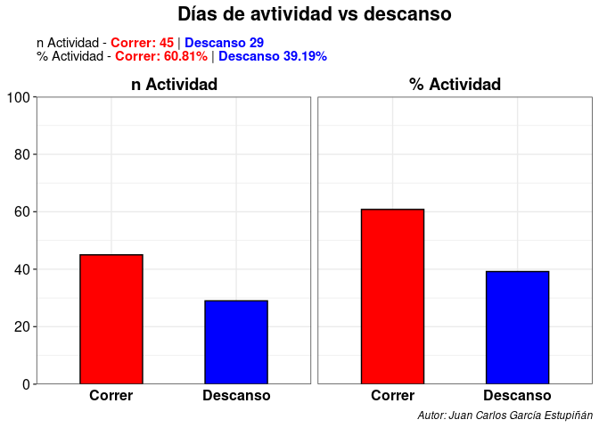
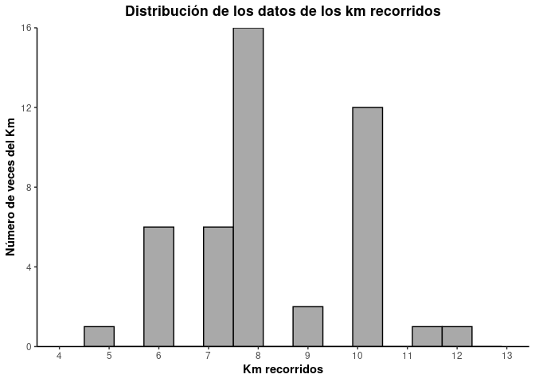
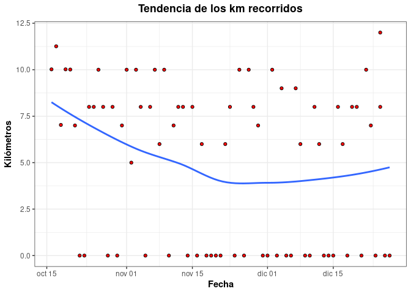
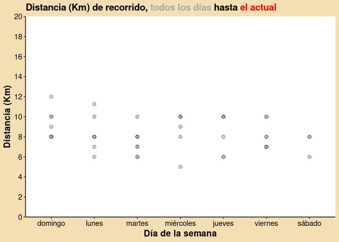

Segumiento General de mi actividad Diaria
================
Juan Carlos
2022-12-29

En este Markdown voy a documetar mi actividad diaria en formato
markdown.

## Cargar los datos:

Leemos el script de R que sirve para cargar los datos en general:

    ## ── Attaching packages ─────────────────────────────────────── tidyverse 1.3.2 ──
    ## ✔ ggplot2 3.4.0      ✔ purrr   1.0.0 
    ## ✔ tibble  3.1.8      ✔ dplyr   1.0.10
    ## ✔ tidyr   1.2.1      ✔ stringr 1.5.0 
    ## ✔ readr   2.1.3      ✔ forcats 0.5.2 
    ## ── Conflicts ────────────────────────────────────────── tidyverse_conflicts() ──
    ## ✖ dplyr::filter() masks stats::filter()
    ## ✖ dplyr::lag()    masks stats::lag()
    ## Loading required package: timechange
    ## 
    ## 
    ## Attaching package: 'lubridate'
    ## 
    ## 
    ## The following objects are masked from 'package:base':
    ## 
    ##     date, intersect, setdiff, union
    ## 
    ## 
    ## 
    ## Attaching package: 'cowplot'
    ## 
    ## 
    ## The following object is masked from 'package:lubridate':
    ## 
    ##     stamp
    ## 
    ## 
    ## Loading required package: carData
    ## 
    ## 
    ## Attaching package: 'car'
    ## 
    ## 
    ## The following object is masked from 'package:dplyr':
    ## 
    ##     recode
    ## 
    ## 
    ## The following object is masked from 'package:purrr':
    ## 
    ##     some
    ## 
    ## 
    ## Rows: 74 Columns: 13
    ## ── Column specification ────────────────────────────────────────────────────────
    ## Delimiter: ","
    ## chr  (1): actividad
    ## dbl  (8): km_recorrido, kcal_quemado, ritmo_cardiaco_promedio_bpm, ritmo_car...
    ## date (1): fecha
    ## time (3): tiempo_min, ritmo_medio_min, ritmo_max_min
    ## 
    ## ℹ Use `spec()` to retrieve the full column specification for this data.
    ## ℹ Specify the column types or set `show_col_types = FALSE` to quiet this message.

## Comenzaremos viendo viendo el % de los días que realizo actividad vs en los que “descanso”.

Calcualremos la suma y porcentaje de cada actividad que hago y
posteriormente realizaremos un gráfico de barras para cada caso:

    ## # A tibble: 2 × 3
    ##   actividad     n porcentaje
    ##   <chr>     <int>      <dbl>
    ## 1 correr       45       60.8
    ## 2 descanso     29       39.2

- \*Gráfico de barras con cada cosa\*\*:

<!-- -->

## Kilómetros recorridos.

### Manipulación de los datos de recorrido.

Estudio descriptivo de los kilómetros recorridos.

<!-- -->

    ## 
    ##  Asymptotic one-sample Kolmogorov-Smirnov test
    ## 
    ## data:  km
    ## D = 0.21256, p-value = 0.03428
    ## alternative hypothesis: two-sided

    ## # A tibble: 7 × 2
    ##   Estadísticos  Valor
    ##   <chr>         <dbl>
    ## 1 Km Mínimo      5   
    ## 2 Km Q1          7   
    ## 3 Km Promedio    8.27
    ## 4 Desviación Km  1.6 
    ## 5 Km Mediana     8   
    ## 6 Km Q2         10   
    ## 7 Km Máximo     12

### Evolución de los kilómetros que corro (incluyendo los descansos)

- Para ello vermos el siguiente gráfico lineal:

<!-- -->

    ## `geom_smooth()` using method = 'loess' and formula = 'y ~ x'

<!-- -->

### Kilómetro recorrido por día de la semana.

<!-- -->
